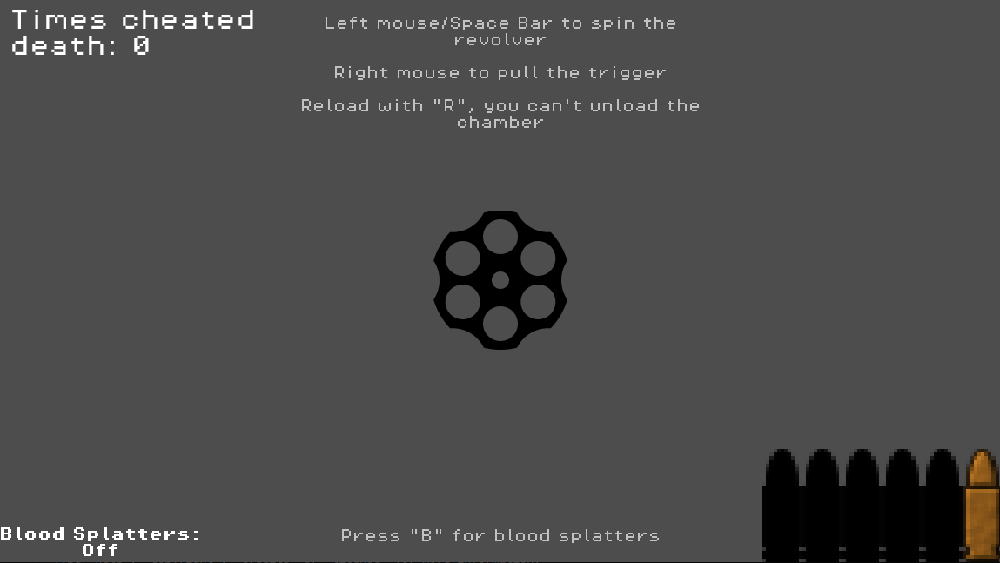
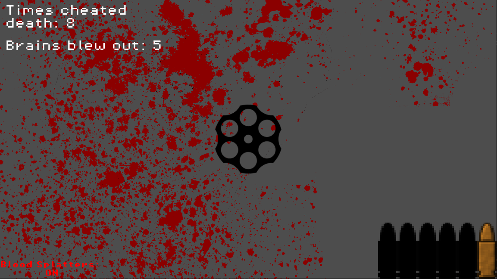
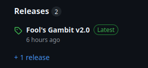

# Fool's Gambit: Russian Roulette mini-game
My first finished project made on Godot, took me one month to finish and It's purpose was to reinforce learning with actual practice while working alongside GDQuest. 

It's a very short, and not so replayable game, but I suppose you can settle some draws with friends or to simply decide how lucky you are feeling that particular day :)

# Features

- Try your luck with one bullet, or five bullets if you feel REAL lucky!!

- Randomly generated blood splatters each time you die

- Suspenseful ambience before each trigger pull (thanks Izzy for the sfx!)

# How to play:

- Download the latest release for your OS and then open the executable, as shrimple as that

# Credits:

The HUD bullet sprites were made by BrighamKeys on OpenGameArt.org (thank you so muucchh)

The splatters images were made by johndh on OpenGameArt.org

The revolver cylinder image was by Arthur Shlain on The Noun Project

The revolver sounds are from Pixabay

## Thank you all, If there's someone else to add please contact me and I'll add the credits :)